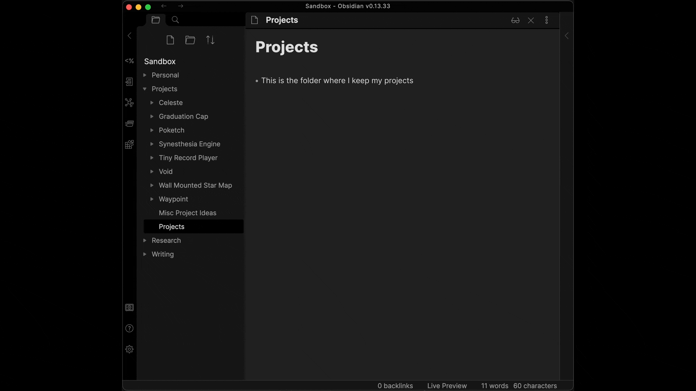

# Waypoint - Automatic Table of Contents Generator for [Obsidian.md](https://obsidian.md/)

Do you use folders to categorize your notes and wish that Obsidian would show certain folders in the graph view? Do you hate having to keep track of tags and links every time a file is created? Do you want to decide what folders should be categories without creating index files for every folder?

Waypoint is an Obsidian plugin that automatically generates tables of contents/MOCs within your folder notes. Once a waypoint is generated, it'll automatically link to every note within the folder and its subfolders. The Waypoint plugin will detect when you create/rename/move/delete a note and automatically stay up-to-date. **No more dealing with loads of tags or manually updating your own content maps!**

### [For updates and support, visit our Discord!](https://discord.gg/6yxE9prcNc)

## Features

- **Automatically generated tables of contents!**
	- Waypoints are created whenever you type the magic word (default is `%% Waypoint %%`) within a folder note. A folder note is any note with the same name as its parent folder.
- **Instant updates whenever files/folders are created, renamed, moved, or deleted**
	- File path changes trigger a scan for any waypoints that might be affected. If a waypoint is found, it is instantly updated in real-time.
- **Folders can now appear on the graph view**
	- Just create a waypoint in a note with the same name as the folder and it'll automatically link to every file within, including files in subfolders!
	- Waypoints can be "nested" to avoid unnecessary links
		- Say your folders go from `A -> B -> C`. If you put a waypoint in the folder note of folder A, it'd include every file within folders A, B, and C. But if you create another waypoint in folder B, the first waypoint would only link to that folder note.
- **Fine-grained control over which folders are considered categories**
	- Since you decide when and where a waypoint is generated in your folder tree, you can decide which folders could be considered "categories" and which are just for organizing.
	- Say you have a folder tree like `Latin -> Chapter I -> Vocab -> ...`. "Latin" and "Chapter I" might be considered important enough to be called categories, but the "Vocab" folder within each chapter is just used to keep things organized. Other plugins might require that an index file is made in every folder, but Waypoint allows you to pick and choose what folder notes contain tables of contents. This means you can avoid creating a waypoint in each "Vocab" folder while still having the waypoints in each chapter folder like directly to each term. And because of how Waypoint prioritizes folder hierarchy, the waypoint in the folder note for "Latin" will only link to the chapter folder notes to avoid creating unnecessary links!
	- **INTRODUCING: Landmarks!**
		- Landmarks use the default magic word of `%% Landmark %%`
		- Landmarks are meant to be used between your waypoints to act as intermediary indexes. They can be placed in subfolder notes of waypoint tags to generate a "waypoint-like" tree without stopping a parent waypoint from including the child files/folders in your tree.
		- Expanding on the description for waypoints above, say you have a parent folder that holds languages such as `Languages -> Latin -> Chapter I -> Vocab -> ...`. Similar to above, you want to have chapters listed for "Latin" and also have them show up on the "Language" folder note. This is achievable with Landmarks! By using `%% Landmark %%`, Waypoint will now generate an index in the current folder note listed as a landmark and will not stop the generation of the parent waypoint at that level, but keep going to list the chapters, as that is where the next waypoint is set.
- **Permanent and portable**
	- Unlike other plugins, Waypoints are generated and saved as real markdown text within your folder notes. If you decide to switch to a different markdown editor that supports [[links]], all of your tables of contents will still be usable.
	- Note that the Waypoint plugin currently only works with Obsidian, so moving files around in another editor will cause your waypoints to be out-of-date.

## How To Use

- First, install the plugin. Waypoint is currently being reviewed for inclusion in the Community Plugins list. Once it is accepted, you'll be able to install it directly within Obsidian.
- Generate a waypoint by editing a folder note (a note with the same name as its parent folder) and typing in the waypoint trigger text. By default, this is `%% Waypoint %%`. Make sure to include the double-percents on both sides!
	- This trigger flag can be changed in settings, but it will always require the double-percents in notes as that is how Obsidian knows it's a comment and not real text.
- And that's it! Waypoints will be automatically updated whenever the files or folders within that folder are changed. Be sure not to remove the `%% Begin Waypoint %%` or `%% End Waypoint %%` flags as this is what the plugin uses to locate the table of contents. Any changes made to the text between these flags will get removed once the waypoint is updated.

Note that since waypoints can only be generated in folder notes, **it is highly recommended that you install a plugin like [Folder Note](https://github.com/xpgo/obsidian-folder-note-plugin)** to ensure that folder notes don't get lost after folder renames and other actions that change the file tree. If a folder note containing a waypoint is renamed to something other than the folder's name, the waypoint will no longer be updated.

## Current Limitations

- **Waypoints can only be created within a folder note**
	- Because scanning for waypoints every time a file/folder is changed is an intensive process, only folder notes are checked to avoid scanning every file in the vault.
- **Waypoints cannot be created on the top level of your vault**
	- Waypoints are meant to categorize notes that are similar to one another. Adding a waypoint to the root node would cause every note in your vault to be linked and defeat the point of using waypoints in the first place.
- **Waypoint appearance can't be customized (yet)**
- **Only one waypoint can be created per folder note**

If your workflow would be improved by the removal of one of these limitations, feel free to reach out to me with your use case and I'll see what I can do!

## FAQ

### Why should I use this instead of just using tags?

Tags are an easy way to sort and organize different notes by a type or category, but they have a few drawbacks that limit their usability. My personal reasons for not using tags extensively are that they need to be added or removed from a note manually and they cannot be nested in a meaningful way. Folders on the other hand are a clear and easy way to lump a bunch of notes into a specific category. And the ability to nest folders makes it a lot easier to document the relationship between individual categories. Using this plugin, you can easily link files in the same folder together without any manual bookkeeping (beyond creating the initial waypoint). I still find myself using tags for defining different types of notes since those are not likely to change even if I move them around.

### How is this different from indexing plugins like [Zoottelkeeper](https://github.com/akosbalasko/zoottelkeeper-obsidian-plugin)?

Zoottelkeeper and other related plugins are more complex and try to solve different problems. Zoottelkeeper automatically creates index files for every single folder in your repository (with customizable blacklists and whitelists). This means that each folder shows up on the graph view and only links to the index file in the folder immediately below the current one. This is great if you use folders sparingly and each folder has a significant and specific meaning, but if you use folders as your main method of organization then your graph will quickly become messy.

Waypoint was created to give users fine-grained control over what folders are significant enough to be considered a "category" of notes. It allows you to create tables of content that link not only to the files in the same folder but to files in subfolders as well. And if you decide that certain subfolders are worthy of a subcategory of their own, creating a waypoint there will automatically prune the parent waypoint and update it to link only to that folder's folder note. If you prefer to have your waypoints only link to the nearest folder note (whether or not they contain a waypoint), you can enable that functionality within the settings.

## Get In Touch

Got any questions, comments, or concerns? Feel free to raise an issue through GitHub or get in touch with me [@IdreesInc](https://github.com/IdreesInc). If you want to see some of my other projects, check out my website [idreesinc.com](https://idreesinc.com/).

